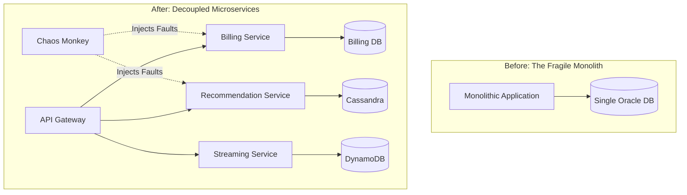
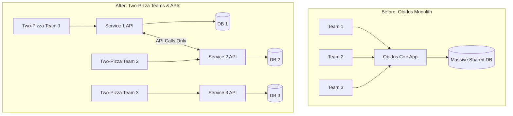
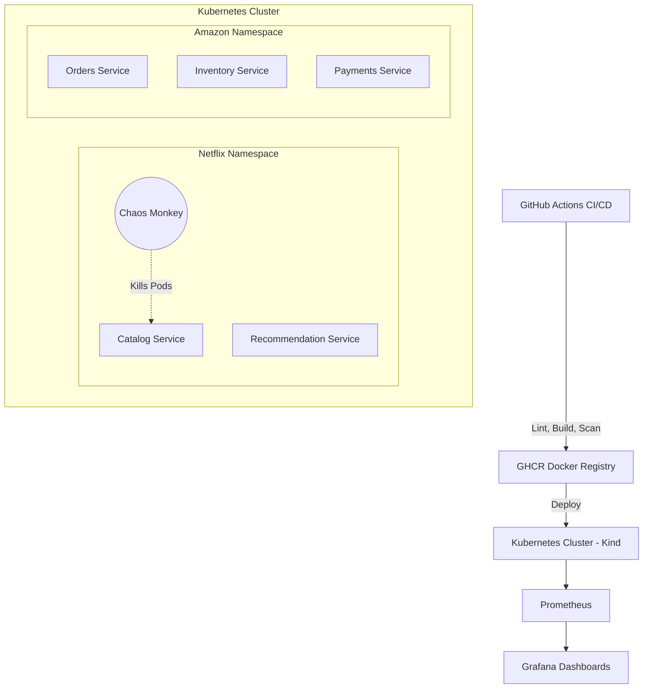

# DevOps Lab CA-II — Aayush Joshi

[](https://github.com/Aayush2308/DevOps-Lab-CA-2/actions/workflows/netflix-ci.yml)
[](https://github.com/Aayush2308/DevOps-Lab-CA-2/actions/workflows/amazon-ci.yml)

## Student Details

| Field | Value |
|---|---|
| **Name** | Aayush Joshi |
| **PRN** | 23070122008 |
| **Batch** | 2023–2027 |
| **Branch** | CSE - A |
| **Institute** | Symbiosis Institute of Technology (SIT), Pune |
| **Assessment** | DevOps Lab — CA-II |

---

# DevOps Case Study Evaluation: CA-II

## Contents
- [Q1. Netflix: Overcoming the Monolith through Microservices and Chaos Engineering](#q1-netflix)
- [Q2. Amazon: Accelerating Release Speed via Two-Pizza Teams & Microservices](#q2-amazon)
- [Hands-on Implementation in This Repository](#hands-on-implementation-in-this-repository)
- [References](#references)

---

## Q1. Netflix: Overcoming the Monolith through Microservices and Chaos Engineering <a name="q1-netflix"></a>

**Question:** In 2008 a database corruption stopped DVD shipments for three days and exposed the fragility of Netflix's monolith. What broke, and how did microservices + Chaos Engineering restore resilience and scale?

### Answer 1: Context
In 2008, Netflix was primarily a DVD-by-mail service. Their entire architecture—UI, sign-up, billing, inventory, and shipping—was a monolithic application backed by a single Oracle database located in a single data center. In August 2008, a severe database corruption occurred, bringing down the entire operation and halting DVD shipments for three days. With the launch of their streaming service in 2007, it became clear that the existing monolithic architecture could not scale globally to meet the bursty nature of streaming traffic.

### 1. Problems with the Monolithic Design
- **Single Point of Failure:** Because billing, browsing, and fulfillment shared a single database, a single fault took down the entire revenue-generating system for three days.
- **Slow, Risky Releases:** Any minor change required rebuilding and redeploying the entire application. Teams were tightly coupled, releases were batched, and a single bug forced a full rollback.
- **Scale-Up, Not Scale-Out:** Scaling meant buying larger servers rather than adding more parallel servers. Physical provisioning took weeks, whereas streaming demand was poised to grow exponentially.
- **Manual, Untested Recovery:** Failover processes were ad-hoc and rarely drilled, leading to high Mean Time To Recovery (MTTR).

### 2. How Netflix Fixed It: Microservices + DevOps + Chaos Engineering
Netflix opted against a simple "lift-and-shift" and decided to rebuild a cloud-native architecture on AWS.
1.  **Microservices Architecture:** They split the monolith into hundreds of independent microservices (Recommendations, Billing, Search, etc.), each with its own datastore (Cassandra/DynamoDB). A billing fault now gracefully degrades without stopping streaming.
2.  **DevOps & Automation:** Netflix adopted a "You build it, you run it" culture. Teams used Spinnaker for continuous delivery and automated pipelines for safe rollbacks.
3.  **Chaos Engineering:** They introduced Chaos Monkey (2010), which randomly terminates production instances to force teams to build resilient, auto-healing systems. 


*Figure 1. Monolith with a single point of failure vs decoupled resilient microservices.*

### 3. Effect on Resilience and Scalability
By embracing this model, Netflix achieved **99.99% availability**. Server provisioning went from weeks to minutes, enabling them to expand to 130+ countries globally. Memberships grew exponentially, and the architecture now smoothly handles over 1 billion API requests per day.

#### Table 1: Netflix Before vs. After
| Dimension | Monolith Era (~2008) | Microservices + AWS + Chaos Era |
|---|---|---|
| **Outage Impact** | 3 days unable to ship DVDs | Zone/region faults auto-failover; 99.99% uptime |
| **Architecture** | 1 monolithic app + 1 Oracle DB | Thousands of microservices, independent databases |
| **Provisioning** | Weeks to rack servers | Thousands of VMs on AWS in minutes |
| **Delivery** | Large, infrequent, risky releases | Continuous delivery with daily fault injection |

---

## Q2. Amazon: Accelerating Release Speed via Two-Pizza Teams & Microservices <a name="q2-amazon"></a>

**Question:** In 2001, Amazon was a massive C++ monolith called "Obidos." How did Jeff Bezos' mandate for decoupled APIs and the "Two-Pizza Team" rule solve their release bottlenecks?

### Answer 2: Context
In 2001, Amazon’s e-commerce platform was powered by a giant monolithic C++ application named "Obidos." As the company grew, development slowed to a crawl. Thousands of developers were modifying the same codebase, resulting in merge conflicts, long testing cycles, and bottlenecked releases. To fix this, Amazon embarked on a radical architectural and organizational shift.

### 1. Problems with the Obidos Monolith
- **Merge Hell:** Thousands of engineers working on one massive codebase caused constant integration conflicts.
- **Release Bottlenecks:** A single deployment required massive coordination. If one team’s code failed, the entire release was rolled back, blocking all other teams.
- **Tight Coupling:** Databases were shared across different domains. The inventory system could directly query the orders database, creating hidden dependencies that broke easily during updates.

### 2. How Amazon Fixed It: APIs + Two-Pizza Teams
Jeff Bezos issued a famous mandate (the "Bezos API Mandate") that forced a radical decoupling of both technology and people.
1.  **Service-Oriented Architecture (SOA):** All teams were required to expose their data and functionality strictly through service interfaces (APIs). Direct database reads by other teams were banned.
2.  **Two-Pizza Teams:** Teams were reorganized to be small enough to be fed by two pizzas (6-10 people). Each team had full ownership of a specific microservice (e.g., the Buy button, Tax calculation).
3.  **CI/CD Pipeline Automation:** Amazon built Apollo, an automated deployment system that allowed each team to deploy their service independently without coordinating with a central release manager.


*Figure 2. Transition from a coupled monolith to independent API-driven Two-Pizza teams.*

### 3. Effect on Release Speed and Innovation
The transformation was staggering. By decoupling teams and services, Amazon went from a slow, monolithic release cycle to deploying code every **11.6 seconds** (by 2011). Teams could innovate rapidly, leading directly to the creation of AWS as they externalized their internal API infrastructure.

#### Table 2: Amazon Before vs. After
| Dimension | Obidos Era (2001) | Microservices Era (Post-SOA) |
|---|---|---|
| **Codebase** | Massive C++ monolith | Highly decoupled microservices |
| **Team Structure** | Large, overlapping silos | "Two-Pizza" independent teams |
| **Release Speed** | Slow, coordinated, risky | Deployments every 11.6 seconds |
| **Data Access** | Direct, shared database queries | Strict network API calls only |

---

## Hands-on Implementation in This Repository <a name="hands-on-implementation-in-this-repository"></a>

This repository proves the concepts from the case studies through fully functional code.

### 1. Architecture Overview


### 2. Repository Navigation
```text
DevOps-Lab-CA-2/
├── case-study-1-netflix/     Q1: Netflix (resilience theme)
│   ├── app/                  FastAPI microservices (catalog + recommendation)
│   ├── task1-pipeline/       → .github/workflows/netflix-ci.yml
│   ├── task2-ansible/        Configuration management (Ansible roles)
│   ├── task3-k8s/            Kubernetes manifests + chaos script
│   ├── task4-monitoring/     Prometheus + Grafana (docker-compose)
│   ├── task5-report/         Markdown reflection report
│   └── evidence/             Real command outputs + screenshot guide
│
└── case-study-2-amazon/      Q2: Amazon (release speed theme)
    ├── app/                  FastAPI microservices (orders + inventory + payments)
    ├── task1-pipeline/       → .github/workflows/amazon-ci.yml
    ├── task2-ansible/        Configuration management (Ansible roles)
    ├── task3-k8s/            Kubernetes manifests + independent deploy demo
    ├── task4-monitoring/     Prometheus + Grafana (docker-compose)
    ├── task5-report/         Markdown reflection report
    └── evidence/             Real command outputs + screenshot guide
```

### 3. Marks Mapping
| Task | Marks | Netflix Implementation | Amazon Implementation |
|---|---|---|---|
| Task 1: CI/CD Pipeline | 2 | `task1-pipeline/` + `.github/workflows/netflix-ci.yml` | `task1-pipeline/` + `.github/workflows/amazon-ci.yml` |
| Task 2: Config Management | 2 | `task2-ansible/` | `task2-ansible/` |
| Task 3: Containerization & K8s | 2 | `task3-k8s/` | `task3-k8s/` |
| Task 4: Monitoring & Logging | 2 | `task4-monitoring/` | `task4-monitoring/` |
| Task 5: Reflection & Report | 2 | `task5-report/` | `task5-report/` |

---

## References <a name="references"></a>
1. Netflix Technology Blog: ["Completing the Netflix Cloud Migration"](https://netflixtechblog.com/completing-the-netflix-cloud-migration-7cb1ce1375a5)
2. Netflix Technology Blog: ["The Netflix Simian Army"](https://netflixtechblog.com/the-netflix-simian-army-16e57fbab116)
3. Werner Vogels (CTO Amazon): ["A Decade of Innovation"](https://www.allthingsdistributed.com/2016/03/10-lessons-from-10-years-of-aws.html)
4. Martin Fowler: ["Microservices"](https://martinfowler.com/articles/microservices.html)
