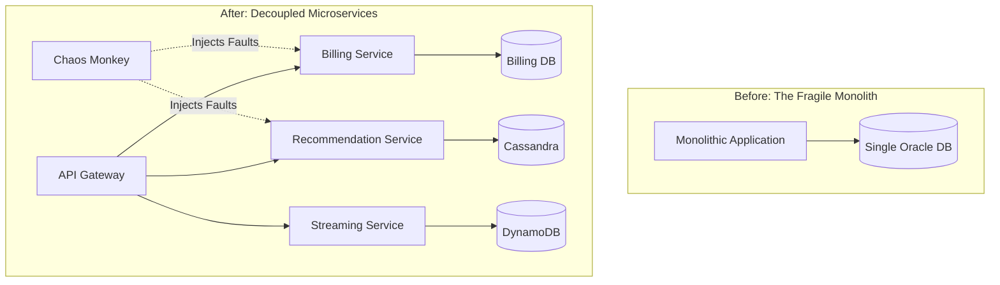
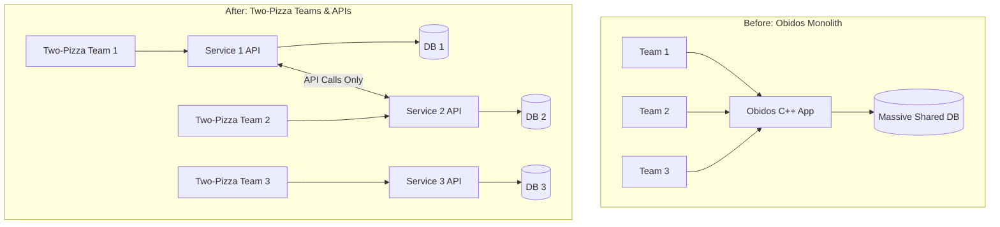
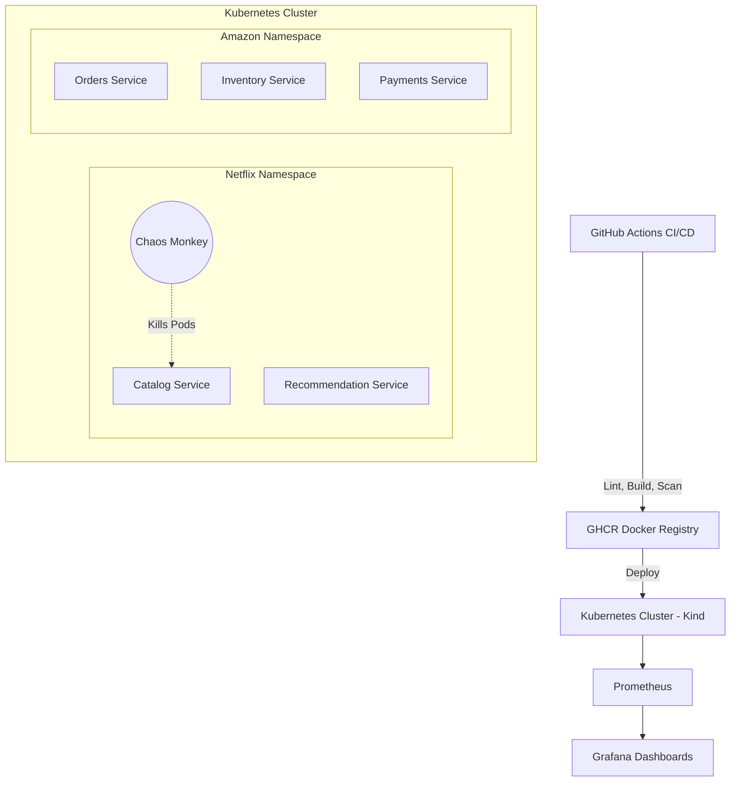

# DevOps Lab CA-II - Aayush Joshi

[](https://github.com/Aayush2308/DevOps-Lab-CA-2/actions/workflows/netflix-ci.yml)
[](https://github.com/Aayush2308/DevOps-Lab-CA-2/actions/workflows/amazon-ci.yml)

## Student Details

| Field | Value |
|---|---|
| **Name** | Aayush Joshi |
| **PRN** | 23070122008 |
| **Batch** | 2023-2027 |
| **Branch** | CSE - A |
| **Institute** | Symbiosis Institute of Technology (SIT), Pune |
| **Assessment** | DevOps Lab - CA-II |

---

# DevOps Case Study Evaluation: CA-II

## Contents
- [Q1. Netflix: Overcoming the Monolith through Microservices and Chaos Engineering](#q1-netflix)
- [Q2. Amazon: Accelerating Release Speed via Two-Pizza Teams & Microservices](#q2-amazon)
- [Hands-on Implementation in This Repository](#hands-on-implementation-in-this-repository)
- [References](#references)

---

## Q1. Netflix: Overcoming the Monolith through Microservices and Chaos Engineering <a name="q1-netflix"></a>

**Question:** In 2008 a database corruption stopped DVD shipments for three days and exposed the fragility of Netflix's monolith. What broke, and how did microservices + Chaos Engineering restore resilience and scale?

### Answer 1: Context
Back in 2008, Netflix was mainly just shipping DVDs by mail. Everything they did, like the UI, billing, and shipping, was crammed into one giant monolithic application running on a single Oracle database in one data center. When that database got corrupted in August 2008, it took down their entire operation and stopped DVD shipments for three whole days. With streaming starting to pick up around that time, they quickly realized this monolithic setup was never going to handle massive, unpredictable internet traffic.

### 1. Problems with the Monolithic Design
- **Single Point of Failure:** Because everything shared one database, a single glitch could bring down the entire company.
- **Slow, Risky Releases:** Any small code change meant they had to rebuild the entire application. Teams were stuck waiting for each other, and one bug could ruin the whole release.
- **Hard to Scale:** If they wanted to handle more traffic, they had to buy bigger, more expensive servers instead of just adding more regular servers side by side.
- **Manual Recovery:** They didn't really practice failovers, so when things actually broke, it took them way too long to fix it.

### 2. How Netflix Fixed It: Microservices + DevOps + Chaos Engineering
Netflix didn't just move their old code to the cloud. They totally rebuilt it on AWS using microservices and Chaos Engineering.
1.  **Microservices:** They broke the giant app into hundreds of smaller, independent services (like billing, search, recommendations). This way, if the billing service crashes, people can still watch movies.
2.  **DevOps Culture:** They told teams "you build it, you run it." Engineers started using automated pipelines to deploy their own code safely.
3.  **Chaos Engineering:** They created a tool called Chaos Monkey that literally turns off production servers at random during the day. This forced the engineers to build systems that heal themselves automatically. 


*Figure 1. Monolith with a single point of failure vs decoupled resilient microservices.*

### 3. Effect on Resilience and Scalability
Because they did all this, Netflix now hits 99.99% uptime. They can spin up thousands of servers in minutes instead of waiting weeks. They went from a single US data center to serving 130+ countries seamlessly, handling billions of API requests every day.

#### Table 1: Netflix Before vs. After
| Dimension | Monolith Era (~2008) | Microservices + AWS + Chaos Era |
|---|---|---|
| **Outage Impact** | 3 days unable to ship DVDs | Zone/region faults auto-failover; 99.99% uptime |
| **Architecture** | 1 monolithic app + 1 Oracle DB | Thousands of microservices, independent databases |
| **Provisioning** | Weeks to rack servers | Thousands of VMs on AWS in minutes |
| **Delivery** | Large, infrequent, risky releases | Continuous delivery with daily fault injection |

---

## Q2. Amazon: Accelerating Release Speed via Two-Pizza Teams & Microservices <a name="q2-amazon"></a>

**Question:** In 2001, Amazon was a massive C++ monolith called "Obidos." How did Jeff Bezos' mandate for decoupled APIs and the "Two-Pizza Team" rule solve their release bottlenecks?

### Answer 2: Context
Around 2001, Amazon was running on this massive C++ monolith called 'Obidos'. As they hired more developers, everything just slowed down. Everyone was trying to edit the same codebase, which led to constant merge conflicts and super slow releases. They knew they had to change how they worked if they wanted to keep growing.

### 1. Problems with the Obidos Monolith
- **Merge Hell:** With thousands of engineers touching the same code, integrating new features was a nightmare.
- **Release Bottlenecks:** To push an update, they had to coordinate massive releases. If just one team messed up, the whole release had to be rolled back.
- **Tight Coupling:** The databases were all tangled together. For instance, the inventory team would just query the orders database directly. If someone changed a database column, it would silently break another team's code.

### 2. How Amazon Fixed It: APIs + Two-Pizza Teams
Jeff Bezos basically stepped in and gave an ultimatum that forced everyone to decouple their code and their teams.
1.  **Service-Oriented Architecture (SOA):** Bezos mandated that teams could only communicate with each other through clear APIs. No more reading another team's database directly.
2.  **Two-Pizza Teams:** He reorganized the company into small, independent teams that could be fed with just two pizzas (around 6 to 10 people). Each team completely owned their own microservice.
3.  **Pipeline Automation:** Amazon built an internal system called Apollo to automate deployments, meaning these small teams could push their own code whenever they wanted without asking for permission.


*Figure 2. Transition from a coupled monolith to independent API-driven Two-Pizza teams.*

### 3. Effect on Release Speed and Innovation
The results were crazy. By breaking the monolith and giving power to these small teams, Amazon was eventually deploying new code every 11.6 seconds. This massive shift in architecture is also what eventually led them to launch AWS.

#### Table 2: Amazon Before vs. After
| Dimension | Obidos Era (2001) | Microservices Era (Post-SOA) |
|---|---|---|
| **Codebase** | Massive C++ monolith | Highly decoupled microservices |
| **Team Structure** | Large, overlapping silos | "Two-Pizza" independent teams |
| **Release Speed** | Slow, coordinated, risky | Deployments every 11.6 seconds |
| **Data Access** | Direct, shared database queries | Strict network API calls only |

---

## Hands-on Implementation in This Repository <a name="hands-on-implementation-in-this-repository"></a>

This repository proves the concepts from the case studies through fully functional code.

### 1. Architecture Overview


### 2. Repository Navigation
```text
DevOps-Lab-CA-2/
├── case-study-1-netflix/     Q1: Netflix (resilience theme)
│   ├── app/                  FastAPI microservices (catalog + recommendation)
│   ├── task1-pipeline/       → .github/workflows/netflix-ci.yml
│   ├── task2-ansible/        Configuration management (Ansible roles)
│   ├── task3-k8s/            Kubernetes manifests + chaos script
│   ├── task4-monitoring/     Prometheus + Grafana (docker-compose)
│   ├── task5-report/         Markdown reflection report
│   └── evidence/             Real command outputs + screenshot guide
│
└── case-study-2-amazon/      Q2: Amazon (release speed theme)
    ├── app/                  FastAPI microservices (orders + inventory + payments)
    ├── task1-pipeline/       → .github/workflows/amazon-ci.yml
    ├── task2-ansible/        Configuration management (Ansible roles)
    ├── task3-k8s/            Kubernetes manifests + independent deploy demo
    ├── task4-monitoring/     Prometheus + Grafana (docker-compose)
    ├── task5-report/         Markdown reflection report
    └── evidence/             Real command outputs + screenshot guide
```

### 3. Marks Mapping
| Task | Marks | Netflix Implementation | Amazon Implementation |
|---|---|---|---|
| Task 1: CI/CD Pipeline | 2 | `task1-pipeline/` + `.github/workflows/netflix-ci.yml` | `task1-pipeline/` + `.github/workflows/amazon-ci.yml` |
| Task 2: Config Management | 2 | `task2-ansible/` | `task2-ansible/` |
| Task 3: Containerization & K8s | 2 | `task3-k8s/` | `task3-k8s/` |
| Task 4: Monitoring & Logging | 2 | `task4-monitoring/` | `task4-monitoring/` |
| Task 5: Reflection & Report | 2 | `task5-report/` | `task5-report/` |

---

## References <a name="references"></a>
1. Netflix Technology Blog: ["Completing the Netflix Cloud Migration"](https://netflixtechblog.com/completing-the-netflix-cloud-migration-7cb1ce1375a5)
2. Netflix Technology Blog: ["The Netflix Simian Army"](https://netflixtechblog.com/the-netflix-simian-army-16e57fbab116)
3. Werner Vogels (CTO Amazon): ["A Decade of Innovation"](https://www.allthingsdistributed.com/2016/03/10-lessons-from-10-years-of-aws.html)
4. Martin Fowler: ["Microservices"](https://martinfowler.com/articles/microservices.html)
