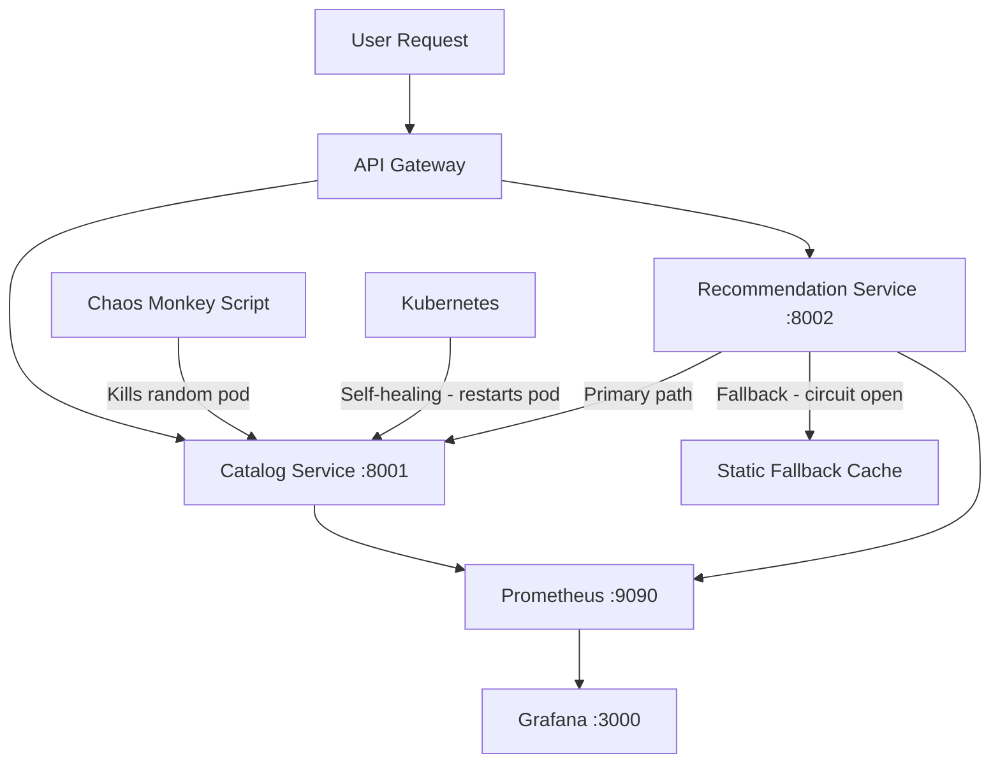

# Case Study 1 — Netflix

## Theme: Resilience via Microservices & Chaos Engineering

**Student:** Aayush Joshi | PRN: 23070122008 | SIT Pune

---

## Architecture



## Services

| Service | Port | Purpose | Key Feature |
|---|---|---|---|
| `catalog-service` | 8001 | Movie catalog CRUD | Stateless, designed to be killed |
| `recommendation-service` | 8002 | User recommendations | Circuit breaker + fallback pattern |

## Task Index

| Task | Location | What it proves |
|---|---|---|
| Task 1: CI/CD | [`.github/workflows/netflix-ci.yml`](../.github/workflows/netflix-ci.yml) | lint → test → build → Trivy → push → deploy |
| Task 2: Ansible | [`task2-ansible/`](task2-ansible/) | Role-based config management, idempotency |
| Task 3: K8s | [`task3-k8s/`](task3-k8s/) | Deployment, rolling update, rollback, chaos |
| Task 4: Monitoring | [`task4-monitoring/`](task4-monitoring/) | Prometheus + Grafana, chaos dashboard |
| Task 5: Report | [`task5-report/`](task5-report/) | .pptx slides + markdown |

## Quick Start

```bash
# Install deps and run locally
cd app/catalog-service
pip install -r requirements.txt
uvicorn main:app --port 8001 --reload

# Second terminal
cd app/recommendation-service
pip install -r requirements.txt
CATALOG_SERVICE_URL=http://localhost:8001 uvicorn main:app --port 8002 --reload
```

Then visit:
- http://localhost:8001/docs — Catalog Swagger UI
- http://localhost:8002/docs — Recommendation Swagger UI
- http://localhost:8002/recommendations/user123 — Test recommendation with fallback
- http://localhost:8001/metrics — Prometheus metrics

## Chaos Monkey Demo

```bash
# Run the chaos script (kills a random catalog-service pod)
bash task3-k8s/chaos-monkey.sh

# Watch self-healing
kubectl get pods -n netflix -w
```

## Evidence

See [`evidence/`](evidence/) for real command outputs.
Screenshots: see [`evidence/README-screenshots.md`](evidence/README-screenshots.md).
