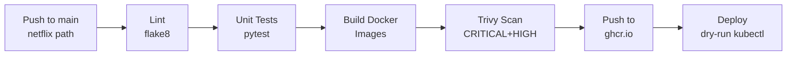

# Task 1: CI/CD Pipeline — Netflix

The workflow file lives at the repo root (GitHub Actions requirement):

**File:** [`.github/workflows/netflix-ci.yml`](../../.github/workflows/netflix-ci.yml)

## Pipeline Stages

## What Each Stage Does

| Stage | Tool | Fail condition |
|---|---|---|
| Lint | flake8 (max 120 chars) | Any PEP8 violation |
| Test | pytest | Any test failure |
| Build | docker buildx | Build error |
| Scan | Trivy | Any CRITICAL or HIGH CVE (unfixed) |
| Push | ghcr.io | Auth failure |
| Deploy | kubectl dry-run | Invalid manifest syntax |

## Evidence

- Screenshot of green pipeline run: `evidence/screenshots/netflix-pipeline-green.png`
- Screenshot of Trivy scan output: `evidence/screenshots/netflix-trivy-scan.png`

> **To trigger:** Push any change to `case-study-1-netflix/` on main branch.
> Go to: https://github.com/Aayush2308/DevOps-Lab-CA-2/actions
