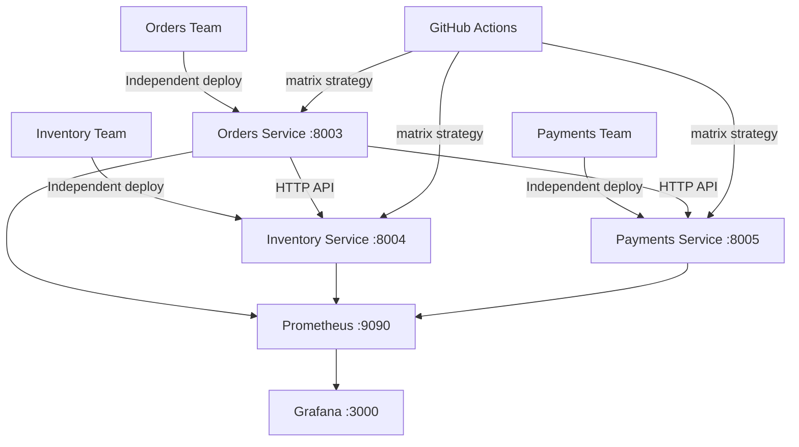

# Case Study 2 — Amazon

## Theme: Release Speed via Two-Pizza Teams & Microservices

**Student:** Aayush Joshi | PRN: 23070122008 | SIT Pune

---

## Architecture



## Services (Two-Pizza Teams)

| Service | Port | Team | Independent Deploy |
|---|---|---|---|
| `orders-service` | 8003 | Orders Team | Yes — own pipeline stage |
| `inventory-service` | 8004 | Inventory Team | Yes — own pipeline stage |
| `payments-service` | 8005 | Payments Team | Yes — own pipeline stage |

Each service has its own Dockerfile, test suite, and pipeline job. A change in payments-service triggers a build **only for payments**, not orders or inventory. This is the Amazon two-pizza team principle in code.

## Task Index

| Task | Location | What it proves |
|---|---|---|
| Task 1: CI/CD | [`.github/workflows/amazon-ci.yml`](../.github/workflows/amazon-ci.yml) | Matrix jobs, independent per-service deploy |
| Task 2: Ansible | [`task2-ansible/`](task2-ansible/) | Role-based config management, idempotency |
| Task 3: K8s | [`task3-k8s/`](task3-k8s/) | Per-service deployments, rolling update, rollback |
| Task 4: Monitoring | [`task4-monitoring/`](task4-monitoring/) | Deploy frequency panel, per-service health |
| Task 5: Report | [`task5-report/`](task5-report/) | .pptx + markdown |

## Quick Start

```bash
# Terminal 1: Orders service
cd app/orders-service
pip install -r requirements.txt
uvicorn main:app --port 8003 --reload

# Terminal 2: Inventory
cd app/inventory-service
pip install -r requirements.txt
uvicorn main:app --port 8004 --reload

# Terminal 3: Payments
cd app/payments-service
pip install -r requirements.txt
uvicorn main:app --port 8005 --reload
```

Swagger UIs: http://localhost:8003/docs, :8004/docs, :8005/docs

## Evidence

See [`evidence/`](evidence/) for real command outputs.
Screenshots: see [`evidence/README-screenshots.md`](evidence/README-screenshots.md).
