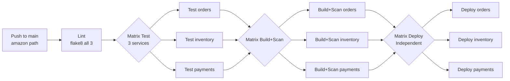

# Task 1: CI/CD Pipeline — Amazon

The workflow file lives at the repo root (GitHub Actions requirement):

**File:** [`.github/workflows/amazon-ci.yml`](../../.github/workflows/amazon-ci.yml)

## Pipeline Stages

## Key Design: Independent Deploys (Two-Pizza Principle)

The `test`, `build-and-scan`, and `deploy` jobs all use `matrix strategy` with `fail-fast: false`.

This means:
- If payments-service tests fail, orders and inventory **still deploy** independently.
- No team blocks another team's release.
- This directly maps to Amazon's documented two-pizza team principle.

## Evidence

- Screenshot of matrix job run (3 parallel): `evidence/screenshots/amazon-pipeline-matrix.png`
- Screenshot of independent deploy step: `evidence/screenshots/amazon-pipeline-deploy.png`
